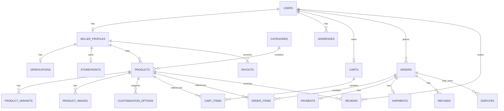

# Entity Relationship Diagram

## Core relationships

```text
User
 ├── SellerProfile
 │    ├── Verification
 │    ├── Storefront
 │    ├── Products
 │    │    ├── ProductVariants
 │    │    ├── ProductImages
 │    │    └── CustomizationOptions
 │    ├── Orders
 │    └── Payouts
 │
 ├── Addresses
 ├── Cart
 ├── Orders
 ├── Reviews
 └── Disputes

Product
 ├── Category
 ├── Maker/Seller
 ├── Variants
 ├── Images
 ├── CustomizationOptions
 └── Reviews

Order
 ├── OrderItems
 ├── Payment
 ├── Shipment
 ├── Refunds
 ├── Dispute
 └── Review eligibility
```

## Mermaid ERD


