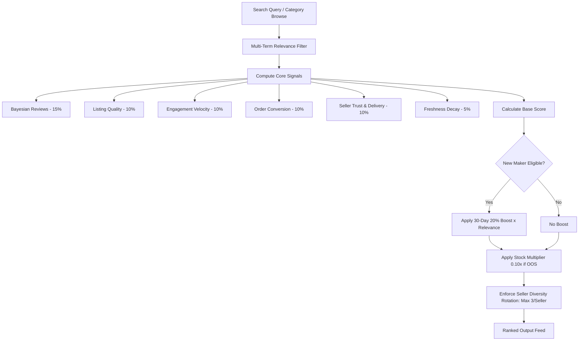

<div align="center">

# 🏺 DastKar Hub (دستکار ہب)
### Pakistan's Premier Handcrafted Artisan Marketplace & Discovery Platform

[-emerald?style=for-the-badge&logo=php&logoColor=white)](services/api/tests)
[](apps/web)
[](apps/web)
[](services/api)
[](services/api/database)

<p align="center">
  <b>Bridging centuries of generational craftsmanship with modern e-commerce discovery.</b><br>
  Direct from artisan workshops in Multan, Hala, Chiniot, Peshawar, Swat, Quetta, Lahore, Karachi, and Gilgit.
</p>

[Explore Features](#-key-features) •
[Discovery Engine](#-internal-discovery--ranking-engine) •
[Quick Start](#-quick-start) •
[API Reference](#-api-endpoints) •
[Craft Heritage](#-regional-craft-clusters) •
[Cybersecurity](#-cybersecurity--governance)

---

</div>

## 🌟 Executive Overview

**DastKar Hub** is a production-grade, full-stack multi-vendor marketplace tailored specifically for Pakistan's artisanal heritage. It eliminates exploitative middleman markups by connecting verified generational craftsmen directly with national and international patrons.

The marketplace features a live, seeded dataset of **325 handcrafted products** across **19 craft disciplines & 81 subcategories**, crafted by **50 verified Pakistani makers**, backed by an **Algorithmic Discovery & Ranking Engine** with **30-Day Artisan Launch Boost**, automated escrow management, and comprehensive mobile-responsive design.

---

## 🚀 Key Features

### 🛍️ Buyer & Patron Experience
* **Curated Craft Discovery:** Browse indigenous crafts with Bayesian rating smoothing, engagement velocity, and regional origin tracking.
* **Flash Craft Bazaar:** Live Daraz-style countdown sales driven directly from backend trending discovery metrics.
* **Artisan Customization:** Real-time personalizations (custom name engraving, Ajrak monograms, artisan gift packaging).
* **Multi-Carrier Checkout:** Seamless checkout supporting Cash on Delivery (COD), JazzCash, EasyPaisa, and Direct Bank Transfer (IBFT) with city-tier shipping calculation.
* **Saved Wishlist & Order Tracking:** Real-time courier dispatch status with order-level transit replacement guarantee.
* **Smooth Navigation:** Automatic scroll-to-top on route changes and tab switches, with a floating glassmorphic Back-to-Top action button.

### 🔨 Artisan / Maker Command Center
* **Storefront Management:** Workshop banner customization, artisan heritage bio, location badges, and live catalog controls.
* **Order Fulfillment Pipeline:** Live tracking from workshop curing/firing to courier pickup and delivery confirmation.
* **30-Day Launch Boost Dashboard:** Transparent status indicator displaying remaining launch days, current boost percentage (+20%), and consistency indicators.
* **Financial Ledger:** Escrow payouts tracking with bank account/IBAN management for direct Raast/1Link disbursements.

### 🛡️ Platform Administration & Governance
* **Artisan Vetting Queue:** Review and approve pending maker studio verification submissions (`basic` &rarr; `verified` &rarr; `established`).
* **Dispute Resolution Desk:** Evidence-based mediation for transit breakages (fragile pottery guarantee) and specification mismatches.
* **Escrow Disbursement Engine:** Double-entry ledger releasing payments upon verified courier delivery.
* **Discovery Parameter Controls:** Live tuning of ranking weights, freshness windows, and anti-monopoly seller diversity limits.

---

## 🧠 Internal Discovery & Ranking Engine

DastKar Hub features a built-in search and discovery ranking engine located at `services/api/app/Services/Discovery/` that dynamically balances consumer relevance, artisan quality, and community fairness.

### Mathematical Scoring Formula

$$\text{Final Score} = \left( \sum_{i=1}^{n} (W_i \times S_i) + \text{Effective Boost} \right) \times \text{Availability Multiplier}$$



### Signal Weights Configuration (`config/discovery.php`)

| Signal | Weight ($W_i$) | Description |
| :--- | :---: | :--- |
| **Relevance** | `0.30` | Multi-token coverage across title, category, materials, dimensions, and artisan city. |
| **Reviews** | `0.15` | Bayesian-smoothed rating ($m=3, C=4.5$) prevents 1-review anomalies from dominating. |
| **Quality** | `0.10` | Evaluates multi-angle images, description depth, care guide, and dimensions. |
| **Engagement** | `0.10` | Log-normalized click and wishlist velocity: $\frac{\log(1 + \text{clicks} + 2.5 \times \text{wishlists})}{\log(501)}$. |
| **Conversion** | `0.10` | Sample-damped purchase rate rewarding high buyer intent. |
| **Seller Trust** | `0.10` | Tier score (`established` > `verified` > `basic`), on-time delivery rate, cancellation penalty. |
| **Freshness** | `0.05` | Linear decay over a 30-day window from publication date. |
| **Availability** | `0.10` | Multiplier penalty ($0.10\times$) applied if an item goes out of stock. |

### 🚀 30-Day Artisan Launch Boost & Consistency Policy
* **Launch Window:** Qualified new verified makers receive up to **+20% discovery boost** (`max_boost_score = 0.20`) during their first 30 days.
* **Consistency Check:** If a maker maintains active stock, fulfills $\ge 90\%$ of orders on time, and keeps cancellations $\le 5\%$, their full boost is preserved. Inconsistent sellers experience linear decay.
* **Relevance Safeguard:** When a shopper searches for specific terms (e.g., `"Multani Blue Pottery"`), the boost is attenuated by query relevance: $\text{EffectiveBoost} = \text{Boost} \times \text{Relevance}$. Irrelevant new products can never leapfrog matching established crafts.
* **Anti-Monopoly Diversity:** Enforces a ceiling of **maximum 3 products per maker** in top discovery feeds, ensuring healthy regional variety.

---

## 🏛️ Regional Craft Clusters

DastKar Hub directly represents Pakistan's recognized geographic artisan hubs:

```text
🇵🇰 Pakistan Artisan Footprint
├── 🏺 Multan & Hala           → Blue Pottery, Glazed Terracotta (Kashigari)
├── 🪑 Chiniot & Gujrat        → Rosewood Carving, Brass Inlay, Sheesham Furniture
├── 🧣 Swat Valley & Kashmir   → Pashmina Wool Weaving, Handloom Shawls, Silver Filigree
├── 👡 Peshawar & Bannu        → Traditional Leather Saddlery, Peshawari Chappals
├── 🎨 Rawalpindi & Lahore     → Pakistani Truck Art, Mughal Miniatures, Calligraphy
├── 🪡 Sindh (Hala, Sukkur)    → Natural Indigo Ajrak, Block Printing, Hurmicho
├── 🪞 Balochistan (Quetta)    → Balochi Mirrorwork, Do-Toch Tribal Embroidery
└── 💎 Gilgit-Baltistan        → Natural Lapis Lazuli, Ruby & Tourmaline Jewelry
```

---

## 📦 Project Architecture & Monorepo Hierarchy

```text
DastKar-Hub/
├── apps/
│   └── web/                                  # Frontend SPA (Vite 8 + React 19 + TypeScript)
│       ├── public/                           # Static assets, logos, favicon
│       ├── src/
│       │   ├── components/                   # Modular UI components
│       │   │   ├── commerce/                 # ProductCard, CartItem, TrustBadges
│       │   │   ├── common/                   # ScrollToTop, Floating Back-To-Top button
│       │   │   ├── layout/                   # Navbar, Footer, MobileBottomNav
│       │   │   └── ui/                       # Toast, Modal, ErrorBoundary
│       │   ├── lib/                          # State management & network layer
│       │   │   ├── api.ts                    # Strongly typed API client with session management
│       │   │   ├── authContext.tsx           # Session context with Sanctum token store
│       │   │   ├── cartContext.tsx           # Cart state with persistent storage
│       │   │   └── wishlistContext.tsx       # Wishlist state with optimistic updates
│       │   ├── pages/                        # Responsive page routes
│       │   │   ├── HomePage.tsx              # Discovery landing, flash sale, collections
│       │   │   ├── ProductListPage.tsx       # Faceted catalog with filter drawer & sorting
│       │   │   ├── ProductDetailPage.tsx     # Gallery, customization, sticky mobile purchase bar
│       │   │   ├── MakersDirectoryPage.tsx   # Artisan directory with craft discipline tabs
│       │   │   ├── MakerProfilePage.tsx      # Artisan storefront with cover & scorecard
│       │   │   ├── CustomerDashboardPage.tsx # Order tracking, wishlist, patron feedback
│       │   │   ├── SellerDashboardPage.tsx   # Maker command center & boost monitor
│       │   │   ├── AdminDashboardPage.tsx    # Governance, verification queue, disputes
│       │   │   ├── AuthPage.tsx              # Clean Patron / Artisan authentication
│       │   │   └── CheckoutPage.tsx          # Multi-step checkout with COD calculation
│       │   └── types/index.ts                # TypeScript interface definitions
│       └── vite.config.ts                    # Vite config with /api reverse proxy to port 8001
│
├── services/
│   └── api/                                  # Backend Modular Monolith (Laravel 12)
│       ├── app/
│       │   ├── Http/Controllers/Api/v1/      # REST API resource controllers
│       │   │   ├── AuthController.php        # Register, login, token issue
│       │   │   ├── CategoryController.php    # Category hierarchy & subcategories
│       │   │   ├── ProductController.php     # Search, filter, ranking sort integration
│       │   │   ├── DiscoveryController.php   # Trending, recommended, new makers, telemetry
│       │   │   ├── SellerDashboardController.php # Maker stats, products, boost status
│       │   │   └── AdminController.php       # Platform GMV, vetting, disputes
│       │   ├── Models/                       # Eloquent models with relations & casts
│       │   │   ├── Product.php               # Product with ranking score & seed flags
│       │   │   ├── SellerProfile.php         # Maker with boost timeline & ratings
│       │   │   ├── Order.php                 # Orders with transactional status
│       │   │   ├── OrderItem.php             # Historical price & product snapshots
│       │   │   └── DiscoveryEvent.php        # Telemetry impression & conversion logs
│       │   └── Services/Discovery/           # Algorithmic Discovery Engine
│       │       ├── ProductRankingService.php # Multi-factor scoring calculation
│       │       ├── MakerRankingService.php   # Artisan tier & score evaluation
│       │       ├── NewSellerBoostService.php # 30-day 20% boost with decay logic
│       │       └── DiscoveryEventService.php # Telemetry ingestion with rate limiting
│       ├── config/discovery.php              # Centralized ranking weights & parameters
│       ├── database/
│       │   ├── migrations/                   # 13 structured database migrations
│       │   └── seeders/                      # 325 products & 50 Pakistani makers seeder
│       ├── routes/api.php                    # Versioned /api/v1 routes with throttling
│       └── tests/Feature/                    # Automated integration & discovery tests
│
├── docs/                                     # Comprehensive architectural documentation
│   ├── demo-data/                            # Seed data breakdown and inventory counts
│   └── discovery/                            # Ranking signals, boost rules, event specs
└── README.md
```

---

## 🛠️ Technology Stack

| Tier | Technologies | Highlights |
| :--- | :--- | :--- |
| **Frontend** | React 19, TypeScript 5.8, Vite 8 | Ultra-fast HMR, sub-second production builds (740ms), strict types. |
| **Styling** | Tailwind CSS v4, Lucide Icons | Responsive layout tokens (320px mobile to 4K), smooth gradients, custom scrollbars. |
| **Backend** | PHP 8.2+, Laravel 12 | Modular Monolith, Laravel Sanctum token auth, service layer pattern. |
| **Database** | SQLite (Dev/Test), PostgreSQL/MySQL (Prod) | Zero-friction local setup, relational foreign key constraints, indexes. |
| **Testing** | PHPUnit, Laravel Feature Testing | 24 automated feature tests with 298 assertions covering all flows. |

---

## ⚡ Quick Start

### Prerequisites
* **Node.js**: v18.x or higher
* **PHP**: v8.2 or higher with `pdo_sqlite`, `mbstring`, `openssl`, `curl`
* **Composer**: v2.x
* **Git**

### 1. Clone the Repository
```bash
git clone https://github.com/okashaxortlogix/DastKar-Hub.git
cd DastKar-Hub
```

### 2. Backend Setup (Laravel API)
```bash
cd services/api

# Install PHP dependencies
composer install

# Set environment
cp .env.example .env
php artisan key:generate

# Run migrations and seed all 325 products & 50 makers
php artisan migrate:fresh --seed

# Start Laravel API server on port 8001
php artisan serve --host=127.0.0.1 --port=8001
```
> The API will be live at `http://127.0.0.1:8001/api/v1`.

### 3. Frontend Setup (React + Vite)
In a new terminal window:
```bash
cd apps/web

# Install npm dependencies
npm install

# Start Vite dev server (automatically proxies /api to port 8001)
npm run dev
```
> Open your browser at **`http://localhost:5173`**.

---

## 📡 API Endpoints

### 🔍 Discovery & Ranking Endpoints
| Method | Endpoint | Description |
| :--- | :--- | :--- |
| `GET` | `/api/v1/discovery/trending` | Returns top engagement crafts with anti-monopoly diversity. |
| `GET` | `/api/v1/discovery/new-arrivals` | Freshness-ranked items within the decay window. |
| `GET` | `/api/v1/discovery/best-sellers` | Order-volume-ranked items. |
| `GET` | `/api/v1/discovery/recommended` | Contextual multi-signal personalized recommendations. |
| `GET` | `/api/v1/discovery/new-makers` | Newly onboarded qualifying studios receiving boost. |
| `GET` | `/api/v1/discovery/config` | Returns current ranking weights and boost parameters. |
| `POST` | `/api/v1/discovery/events` | Ingests impression, click, and conversion telemetry. |

### 🏺 Catalog & Marketplace Endpoints
| Method | Endpoint | Description |
| :--- | :--- | :--- |
| `GET` | `/api/v1/categories` | Complete craft categories hierarchy with subcategories. |
| `GET` | `/api/v1/products?sort=ranked` | Catalog browsing with search, filtering, and discovery scoring. |
| `GET` | `/api/v1/products/{slug}` | Product detail with variants, customization options, and maker bio. |
| `GET` | `/api/v1/makers` | Verified artisan directory with regional and discipline filters. |
| `GET` | `/api/v1/makers/{slug}` | Artisan public studio profile with scorecard metrics. |
| `POST` | `/api/v1/checkout/quote` | Calculates shipping rates, tax, and item pricing authoritative total. |

---

## 🧪 Testing & Validation

Execute the full backend test suite covering all discovery scenarios, consistency rules, and checkout integrity:

```bash
cd services/api
php artisan test
```

### Test Suite Output
```text
   PASS  Tests\Unit\ExampleTest
  ✓ that true is true

   PASS  Tests\Feature\AdvancedMarketplaceTest
  ✓ payment webhook idempotency and signature handling
  ✓ seller shipment booking and courier webhook delivery
  ✓ payout ledger double entry and disbursement
  ✓ dispute creation and admin refund resolution
  ✓ seller verification workflow
  ✓ security idor and unauthorized access protection

   PASS  Tests\Feature\DiscoveryRankingTest
  ✓ scenario 1 new verified seller is eligible for boost
  ✓ consistency maintains boost while inconsistency decays score
  ✓ scenario 2 seller outside boost window receives zero boost
  ✓ scenario 3 out of stock product penalized in ranking
  ✓ scenario 4 relevance protection prevents boost override
  ✓ scenario 5 new seller with relevant product gets boost
  ✓ scenario 6 seller diversity prevents single seller monopoly
  ✓ scenario 7 established high performer stays competitive
  ✓ discovery endpoints return successful responses
  ✓ discovery event recording
  ✓ seeded data integrity audit

   PASS  Tests\Feature\MarketplaceApiTest
  ✓ categories api returns active categories
  ✓ products api returns craft products
  ✓ checkout quote calculates correct totals
  ✓ buyer registration and login
  ✓ end to end order placement preserves historical snapshots

  Tests:    24 passed (298 assertions)
  Duration: ~34s
```

Frontend production build check:
```bash
cd apps/web
npm run build
# ✓ built in 740ms (0 errors)
```

---

## 🔒 Cybersecurity & Governance

* **IDOR Protection:** All artisan mutations (`/api/v1/seller/*`) are strictly scoped to the authenticated Sanctum user's `sellerProfile->id`.
* **Authoritative Pricing:** Cart prices, discounts, customization deltas, and shipping rules are evaluated strictly server-side inside atomic database transactions (`DB::transaction`).
* **Input Sanitization:** Stored XSS defense applies strict character filtering on all user submissions.
* **Brute-Force Throttling:** Authentication endpoints enforce strict rate limits (`throttle:6,1` on login, `throttle:10,1` on registration).
* **Defensive HTTP Headers:** Injected by `SecurityHeaders` middleware: `X-Frame-Options: SAMEORIGIN`, `X-Content-Type-Options: nosniff`, `Referrer-Policy: strict-origin-when-cross-origin`.

---

## 👥 Contributors & License

Developed with passion for Pakistani artisan communities by **Muhammad Okasha** ([@okashaxortlogix](https://github.com/okashaxortlogix)).

Distributed under the **MIT License**. Preserving cultural heritage through open, accessible technology.
