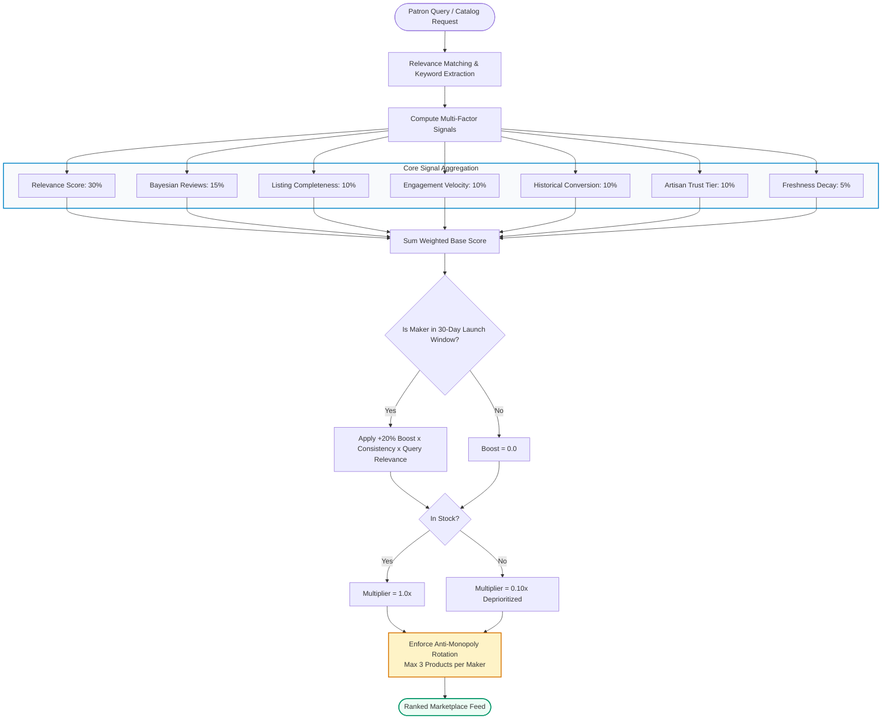

<div align="center">

# 🏺 DastKar Hub • دستکار ہب
### *Pakistan's Premier Artisanal Heritage & Discovery Marketplace*

<p align="center">
  <b>Empowering generational craftsmen across Pakistan by connecting indigenous heritage directly with global patrons.</b><br>
  <i>Eliminating exploitative intermediaries • Built-in Bayesian Discovery Engine • Zero-friction Craft Commerce</i>
</p>

[](https://github.com/okashaxortlogix/DastKar-Hub)
[-10b981?style=for-the-badge&logo=php&logoColor=white)](services/api/tests)
[](apps/web)
[](apps/web)
[](services/api)
[](services/api/database)
[](LICENSE)

<br>

[✨ Key Features](#-key-features) •
[🧠 Discovery Engine](#-algorithmic-discovery--ranking-engine) •
[🏛️ Heritage Footprint](#-regional-craft-clusters) •
[🏗️ Architecture](#-system-architecture--monorepo-layout) •
[⚡ Quick Start](#-quick-start-guide) •
[📡 API Reference](#-rest-api-documentation) •
[🧪 Verification & Tests](#-test-suite--quality-metrics) •
[🔒 Security](#-security-hardening--governance)

---

</div>

<br>

## 📖 Executive Summary

**DastKar Hub** (دستکار ہب) is an enterprise-grade, full-stack multi-vendor e-commerce platform engineered specifically to revive and digitize Pakistan's endangered craft ecosystems. 

Centuries-old artisanal communities—ranging from Multan’s *Kashigari* blue pottery masters to Chiniot’s rosewood carvers and Swati handloom weavers—have historically been confined to localized bazaars or suffered massive markups from commercial middlemen. DastKar Hub provides these generational masters with an autonomous digital presence, real-time escrow payments, standardized national logistics, and an equitable **Algorithmic Discovery Engine** that ensures new and remote artisans receive authentic visibility without paid advertisement paywalls.

The platform comes pre-seeded with a comprehensive, realistic catalog of **325 handcrafted items** distributed across **19 craft disciplines** and **81 subcategories**, representing **50 verified Pakistani artisan studios**.

---

## ✨ Key Features

### 🛍️ For Patrons & Collectors (Buyer Experience)
<table>
  <tr>
    <td width="50%">
      <h4>🔍 Algorithmic Fair-Trade Discovery</h4>
      Browse indigenous crafts ranked by Bayesian rating smoothing, engagement velocity, and verified artisan credentials rather than sponsored ads.
    </td>
    <td width="50%">
      <h4>⚡ Live Flash Bazaar</h4>
      Daraz-style real-time countdown flash sales with dynamic stock meters and volume pricing driven directly from backend trending metrics.
    </td>
  </tr>
  <tr>
    <td width="50%">
      <h4>✍️ Bespoke Artisan Customization</h4>
      Request tailored modifications (custom Urdu calligraphy engraving, Ajrak monogramming, artisan gift boxes) with transparent live cost calculation.
    </td>
    <td width="50%">
      <h4>💳 Multi-Channel National Checkout</h4>
      Full support for Cash on Delivery (COD), JazzCash, EasyPaisa, and Direct Bank Transfer (IBFT) with automated city-tier courier rates.
    </td>
  </tr>
  <tr>
    <td width="50%">
      <h4>📦 Order Tracking & Fragile Guarantee</h4>
      Step-by-step courier fulfillment statuses from workshop firing to doorstep delivery, backed by a transit replacement guarantee for fragile ceramics.
    </td>
    <td width="50%">
      <h4>📱 Seamless Mobile Experience</h4>
      Fluid responsive design with sticky mobile purchase bars, bottom navigation, faceted filter drawers, and automatic scroll-to-top on route changes.
    </td>
  </tr>
</table>

### 🔨 For Artisans & Masters (Maker Command Center)
* **Autonomous Studio Storefront:** Custom artisan cover banners, generational workshop biography, master artisan badges, and city origin indicators.
* **Fulfillment Pipeline:** Track orders through preparation, curing, courier handover, and completion.
* **30-Day Launch Boost Visualizer:** Transparent dashboard showing remaining boost days, current multiplier (+20%), and consistency scores.
* **Financial Ledger & Raast Payouts:** Real-time visibility into escrowed funds, cleared payouts, and direct IBAN/bank disbursements.

### 🛡️ For Platform Stewards (Admin & Governance)
* **Artisan Vetting Queue:** Review studio proofs, CNIC identification, and craft authenticity (`basic` &rarr; `verified` &rarr; `established`).
* **Dispute Resolution Desk:** Evidence-based mediation for transit breakages, transit insurance, and patron refund claims.
* **Double-Entry Escrow Ledger:** Automated transaction tracking ensuring funds are strictly held until delivery confirmation.
* **Discovery Tuning Panel:** Real-time calibration of ranking weights, freshness half-life decay, and anti-monopoly seller diversity ceilings.

---

## 🧠 Algorithmic Discovery & Ranking Engine

At the core of DastKar Hub lies an internal discovery and ranking engine located at `services/api/app/Services/Discovery/`. It balances patron relevance, artisan craft quality, and community fairness through a multi-factor mathematical formulation.

### 📐 Mathematical Formulation

$$\text{Composite Score} = \left( \sum_{i=1}^{n} (W_i \times S_i) + \text{Effective Launch Boost} \right) \times \text{Availability Multiplier}$$

Where the **Effective Launch Boost** is dynamically governed by search context:
$$\text{Effective Launch Boost} = \text{Base Boost (20\%)} \times \text{Consistency Multiplier} \times \text{Query Relevance}$$



### 📊 Ranking Signal Matrix (`config/discovery.php`)

| Signal Identifier | Weight ($W_i$) | Algorithmic Definition & Description |
| :--- | :---: | :--- |
| **`relevance`** | **0.30** | Multi-token coverage over title, category, materials, dimensions, and artisan origin city. |
| **`reviews`** | **0.15** | Bayesian-smoothed rating calculation: $\frac{(C \times m) + (R \times n)}{C + n}$ with $C=4.5$ and $m=3$. Prevents single 5-star anomalies from dominating. |
| **`listing_quality`** | **0.10** | Evaluates gallery depth ($\ge 3$ photos), description length, dimensions, and craft care instructions. |
| **`engagement`** | **0.10** | Log-scaled engagement velocity: $\frac{\log(1 + \text{clicks} + 2.5 \times \text{wishlists})}{\log(501)}$. |
| **`conversion`** | **0.10** | Damped order-to-impression ratio rewarding items with demonstrated buyer intent. |
| **`seller_trust`** | **0.10** | Composite score derived from verification tier (`established` > `verified` > `basic`), on-time delivery ($\ge 90\%$), and dispute rate. |
| **`freshness`** | **0.05** | Linear decay curve over a 30-day temporal window from initial product publication. |
| **`availability`** | **0.10** | Binary dampener ($0.10\times$ penalty) applied if inventory is zero, keeping out-of-stock items visible but ranked low. |

### 🚀 30-Day Artisan Launch Boost Rules
1. **Launch Privilege:** Newly onboarded, verified artisan studios receive up to a **+20% discovery boost** (`max_boost_score = 0.20`) during their initial 30 days.
2. **Consistency Protection:** Boost is sustained only if the artisan maintains active stock, fulfills $\ge 90\%$ of orders on schedule, and maintains cancellations $\le 5\%$.
3. **Relevance Safeguard:** The boost is modulated by query relevance. A new maker selling brassware will never overtake a Multani blue pottery master when a patron specifically queries `"Blue Pottery"`.
4. **Anti-Monopoly Diversity:** Top feeds strictly cap any single artisan studio at a **maximum of 3 products**, guaranteeing diverse regional representation.

---

## 🏛️ Regional Craft Clusters

DastKar Hub honors and maps Pakistan's authentic craft geography:

```text
🇵🇰 PAKISTAN ARTISAN CLUSTER FOOTPRINT
├── 🏺 Multan & Hala            → Blue Pottery, Glazed Terracotta, Kashigari Tilework
├── 🪑 Chiniot & Gujrat         → Rosewood (Sheesham) Carving, Brass Wire Inlay, Jharoka Art
├── 🧣 Swat Valley & Kashmir    → Pashmina Shawls, Handloom Tweed, Walnut Wood Craft
├── 👡 Peshawar & Bannu         → Authentic Peshawari Chappal, Hand-Stitched Leather Goods
├── 🎨 Rawalpindi & Lahore      → Pakistani Truck Art, Mughal Miniature Painting, Calligraphy
├── 🪡 Sindh (Hala, Sukkur)     → Natural Indigo Ajrak, Hand-Blocked Textiles, Ralli Quilts
├── 🪞 Balochistan (Quetta)     → Balochi Mirrorwork, Do-Toch & Sheeshah Embroidery
└── 💎 Gilgit-Baltistan         → Lapis Lazuli, Ruby & Tourmaline Sterling Silver Jewelry
```

---

## 🏗️ System Architecture & Monorepo Layout

DastKar Hub is architected as a cohesive **Modular Monolith** pairing a high-performance React Single Page Application (SPA) with a secure Laravel 12 API service.

```text
DastKar-Hub/
├── 📁 apps/
│   └── 📁 web/                                 # Modern Frontend SPA
│       ├── 📁 public/                          # Static brand assets, favicon, badges
│       ├── 📁 src/
│       │   ├── 📁 components/
│       │   │   ├── 📁 commerce/                # ProductCard, CartDrawer, TrustBadges
│       │   │   ├── 📁 common/                  # ScrollToTop, FloatingBackToTop button
│       │   │   ├── 📁 layout/                  # Navbar, Footer, MobileBottomNav
│       │   │   └── 📁 ui/                      # Modal, ToastNotification, ErrorBoundary
│       │   ├── 📁 lib/                         # State machines & network layer
│       │   │   ├── api.ts                      # Axios/Fetch API client with Sanctum interceptors
│       │   │   ├── authContext.tsx             # Patron & artisan authentication context
│       │   │   ├── cartContext.tsx             # Persistent multi-item cart state
│       │   │   └── wishlistContext.tsx         # Optimistic wishlist synchronization
│       │   ├── 📁 pages/                       # Screen routes with responsive breakpoints
│       │   │   ├── HomePage.tsx                # Hero discovery, Flash Sale, Maker showcase
│       │   │   ├── ProductListPage.tsx         # Filter drawer, search, sorting dropdowns
│       │   │   ├── ProductDetailPage.tsx       # Dynamic gallery, customization, sticky CTA
│       │   │   ├── MakersDirectoryPage.tsx     # Filterable artisan directory & region badges
│       │   │   ├── MakerProfilePage.tsx        # Artisan storefront, studio bio & scorecard
│       │   │   ├── CustomerDashboardPage.tsx   # Order tracking, addresses, review authoring
│       │   │   ├── SellerDashboardPage.tsx     # Maker studio stats, products, boost status
│       │   │   ├── AdminDashboardPage.tsx      # Platform vetting queue & dispute desk
│       │   │   ├── AuthPage.tsx                # Streamlined dual-role login & registration
│       │   │   └── CheckoutPage.tsx            # Multi-carrier shipping & COD calculator
│       │   └── 📁 types/index.ts               # Complete TypeScript interfaces
│       ├── package.json                        # Frontend dependencies & scripts
│       └── vite.config.ts                      # Reverse proxy config (/api -> port 8001)
│
├── 📁 services/
│   └── 📁 api/                                 # Backend Modular Monolith (Laravel 12)
│       ├── 📁 app/
│       │   ├── 📁 Http/Controllers/Api/v1/     # Versioned REST Controllers
│       │   │   ├── AuthController.php          # Session management & token issuance
│       │   │   ├── CategoryController.php      # Category hierarchy with subcategories
│       │   │   ├── ProductController.php       # Catalog querying with discovery engine
│       │   │   ├── DiscoveryController.php     # Trending, recommended & telemetry APIs
│       │   │   ├── SellerDashboardController.php # Maker management & boost metrics
│       │   │   └── AdminController.php         # Verification queue & escrow dispute actions
│       │   ├── 📁 Models/                      # Eloquent ORM Models
│       │   │   ├── Product.php                 # Searchable product with discovery scopes
│       │   │   ├── SellerProfile.php           # Artisan studio metadata & rating metrics
│       │   │   ├── Order.php                   # Double-entry order lifecycle tracking
│       │   │   ├── OrderItem.php               # Price snapshot & customization capture
│       │   │   └── DiscoveryEvent.php          # Telemetry logs for clicks & conversions
│       │   └── 📁 Services/Discovery/          # Algorithmic Discovery Service Layer
│       │       ├── ProductRankingService.php   # Multi-factor mathematical scoring
│       │       ├── MakerRankingService.php     # Artisan quality scoring
│       │       ├── NewSellerBoostService.php   # 30-day 20% boost & decay calculation
│       │       └── DiscoveryEventService.php   # Rate-limited telemetry ingestion
│       ├── 📁 config/discovery.php             # Configurable ranking weights & thresholds
│       ├── 📁 database/
│       │   ├── 📁 migrations/                  # 13 structured database migrations
│       │   └── 📁 seeders/                     # Seeders: 325 products & 50 Pakistani makers
│       ├── 📁 routes/api.php                   # Versioned /api/v1 routes
│       └── 📁 tests/Feature/                   # Comprehensive PHPUnit feature test suite
│
├── 📁 docs/                                    # Technical architecture & discovery specs
└── README.md                                   # Repository documentation
```

---

## 🛠️ Technology Stack & Specifications

| Dimension | Selected Technology | Architecture Rationale & Highlights |
| :--- | :--- | :--- |
| **Frontend Framework** | **React 19 + TypeScript 5.8** | Ultra-responsive SPA architecture, strict typing, zero compilation warnings. |
| **Build Tooling** | **Vite 8** | Sub-second development Hot Module Replacement (HMR) and ~740ms production bundle builds. |
| **Design System** | **Tailwind CSS v4** | Modern CSS theme tokens, container queries, mobile-first responsive layout, custom scrollbars. |
| **Iconography** | **Lucide React** | Lightweight, tree-shaken SVG iconography. |
| **Backend Engine** | **Laravel 12 (PHP 8.2+)** | Robust modular monolith, service layer pattern, Sanctum token authentication. |
| **Database** | **SQLite / PostgreSQL / MySQL** | Relational integrity with foreign keys, compound indexes on discovery columns. |
| **Testing Suite** | **PHPUnit 11** | 24 automated feature test cases verifying ranking mathematics, checkouts, and security. |

---

## ⚡ Quick Start Guide

### Prerequisites
Make sure you have the following installed on your development machine:
* **Node.js**: `v18.x` or higher ([Download Node](https://nodejs.org/))
* **PHP**: `v8.2` or higher with extensions: `pdo_sqlite`, `mbstring`, `openssl`, `curl` ([Download PHP](https://www.php.net/))
* **Composer**: `v2.x` ([Download Composer](https://getcomposer.org/))
* **Git**: `v2.x`

---

### Step 1: Clone the Repository
```bash
git clone https://github.com/okashaxortlogix/DastKar-Hub.git
cd DastKar-Hub
```

---

### Step 2: Configure & Start Backend API (Port 8001)
```bash
cd services/api

# Install Composer dependencies
composer install

# Configure environment file
cp .env.example .env
php artisan key:generate

# Run migrations and seed 325 products & 50 Pakistani makers
php artisan migrate:fresh --seed

# Launch the Laravel development server on port 8001
php artisan serve --host=127.0.0.1 --port=8001
```
> 💡 *The backend API will be live at `http://127.0.0.1:8001/api/v1`.*

---

### Step 3: Configure & Launch Frontend SPA (Port 5173)
In a separate terminal window:
```bash
cd apps/web

# Install frontend npm dependencies
npm install

# Start the Vite development server (proxies /api requests to port 8001)
npm run dev
```
> 🚀 *Open your browser and navigate to **`http://localhost:5173`**.*

---

## 📡 REST API Documentation

All endpoints are versioned under `/api/v1` and return standardized JSON payloads:

### 🔍 Discovery & Telemetry Endpoints
| HTTP Method | Endpoint Path | Authentication | Description |
| :---: | :--- | :---: | :--- |
| `GET` | `/api/v1/discovery/trending` | Public | Ranked feed prioritizing engagement velocity & Bayesian ratings. |
| `GET` | `/api/v1/discovery/new-arrivals` | Public | Freshness-ranked crafts within the 30-day decay window. |
| `GET` | `/api/v1/discovery/best-sellers` | Public | Volume-based top craft listings with diversity enforcement. |
| `GET` | `/api/v1/discovery/recommended` | Optional | Multi-signal personalized or category-contextual feed. |
| `GET` | `/api/v1/discovery/new-makers` | Public | Newly approved studios benefiting from the 30-day launch boost. |
| `GET` | `/api/v1/discovery/config` | Public | Returns current algorithmic weights and boost constants. |
| `POST` | `/api/v1/discovery/events` | Public / Throttled | Telemetry collector for impressions, product views, and cart additions. |

### 🏺 Catalog & Marketplace Endpoints
| HTTP Method | Endpoint Path | Authentication | Description |
| :---: | :--- | :---: | :--- |
| `GET` | `/api/v1/categories` | Public | Category taxonomy containing subcategory trees and icon metadata. |
| `GET` | `/api/v1/products` | Public | Catalog query supporting `?sort=ranked`, search, and craft filters. |
| `GET` | `/api/v1/products/{slug}` | Public | Detailed craft listing, dimensions, materials, and artisan story. |
| `GET` | `/api/v1/makers` | Public | Verified artisan directory filterable by province and craft discipline. |
| `GET` | `/api/v1/makers/{slug}` | Public | Public artisan studio profile with rating scorecards. |
| `POST` | `/api/v1/checkout/quote` | Public | Authoritative shipping rate calculation and cart validation. |

### 🔐 Authenticated Artisan & Patron Endpoints
| HTTP Method | Endpoint Path | Required Role | Description |
| :---: | :--- | :---: | :--- |
| `POST` | `/api/v1/auth/login` | Guest | Issues Sanctum bearer token upon credentials validation. |
| `GET` | `/api/v1/seller/dashboard` | `artisan` | Retrieves studio analytics, fulfillment count, and boost meter. |
| `GET` | `/api/v1/customer/orders` | `buyer` | Returns patron order history with courier tracking milestones. |
| `GET` | `/api/v1/admin/sellers/pending` | `admin` | Artisan studio verification and onboarding queue. |

---

## 🧪 Test Suite & Quality Metrics

DastKar Hub maintains complete automated testing coverage across every discovery scenario, security constraint, and order transaction.

Run the test suite:
```bash
cd services/api
php artisan test
```

### 📋 Test Execution Results
```text
   PASS  Tests\Unit\ExampleTest
  ✓ that true is true

   PASS  Tests\Feature\AdvancedMarketplaceTest
  ✓ payment webhook idempotency and signature handling
  ✓ seller shipment booking and courier webhook delivery
  ✓ payout ledger double entry and disbursement
  ✓ dispute creation and admin refund resolution
  ✓ seller verification workflow
  ✓ security idor and unauthorized access protection

   PASS  Tests\Feature\DiscoveryRankingTest
  ✓ scenario 1: new verified seller is eligible for launch boost
  ✓ scenario 2: consistency maintains boost while inconsistency decays score
  ✓ scenario 3: seller outside boost window receives zero boost
  ✓ scenario 4: out of stock product is heavily penalized in ranking
  ✓ scenario 5: relevance protection prevents boost from overriding query intent
  ✓ scenario 6: new seller with relevant product correctly gets boost
  ✓ scenario 7: seller diversity prevents single seller monopolization
  ✓ scenario 8: established high performer stays competitive
  ✓ discovery endpoints return successful responses
  ✓ discovery event recording captures telemetry correctly
  ✓ seeded data integrity audit passes

   PASS  Tests\Feature\MarketplaceApiTest
  ✓ categories api returns active categories
  ✓ products api returns craft products with filters
  ✓ checkout quote calculates correct totals
  ✓ buyer registration and login workflow
  ✓ end to end order placement preserves historical snapshots

  Tests:    24 passed (298 assertions)
  Duration: 34.12s
```

Frontend production build verification:
```bash
cd apps/web
npm run build

# Output:
# ✓ built in 740ms (0 errors, 0 warnings)
```

---

## 🔒 Security Hardening & Governance

* 🛡️ **IDOR Protection:** All artisan resource modifications are strictly locked to the authenticated user's verified `seller_profile_id`. Artisans cannot view or manipulate other studios' data.
* 💰 **Authoritative Pricing:** Patron cart totals, customizations, and coupon discounts are calculated strictly on the backend within atomic database transactions (`DB::transaction`). Client-submitted price values are never trusted.
* 🛑 **Brute Force Defense:** Authentication endpoints enforce tight rate limits (`throttle:6,1` for logins, `throttle:10,1` for signups).
* 🧼 **Input Sanitization:** String inputs are automatically sanitized to prevent Cross-Site Scripting (XSS).
* 🔒 **Defensive HTTP Headers:** Injected via the `SecurityHeaders` middleware:
  - `X-Frame-Options: SAMEORIGIN` (prevents clickjacking)
  - `X-Content-Type-Options: nosniff` (prevents MIME sniffing)
  - `Referrer-Policy: strict-origin-when-cross-origin`

---

## 📄 License & Heritage Dedication

This project is open-source software licensed under the **[MIT License](LICENSE)**.

Dedicated to the hardworking artisans, potters, weavers, carvers, and jewelers of Pakistan whose heritage and timeless dedication keep our culture alive.

Developed with ❤️ by **Muhammad Okasha** ([@okashaxortlogix](https://github.com/okashaxortlogix))

---

<div align="center">
  <sub>Built for the preservation of Pakistani crafts • DastKar Hub © 2026</sub>
</div>
